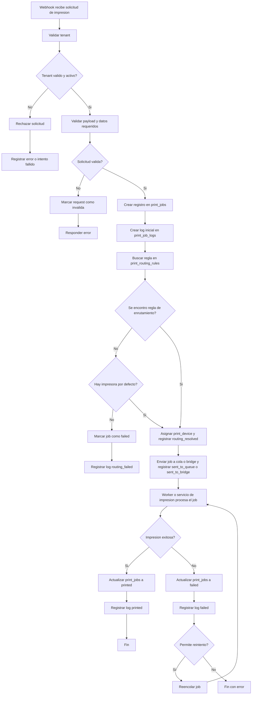

# Flujo operativo del sistema de impresion

Este flujo esta alineado con los modelos y enums reales del schema Prisma.

## Explicacion paso a paso

### 1. El sistema externo o modulo interno manda una peticion al webhook

Puede venir desde:

- Yard
- Billing
- Maintenance
- Bascula
- Inventario

La peticion incluye cosas como:

- tenant
- origen
- ubicacion
- tipo de documento
- payload
- copias

### 2. Se identifica el tenant

El sistema valida:

- tenantId o slug
- api_key o firma
- estado del tenant

Si el tenant no existe o esta suspendido, se rechaza.

### 3. Se valida la solicitud

Se revisa que:

- el payload tenga la estructura esperada
- exista el source
- exista la location si fue enviada
- el tipo de documento sea valido
- la impresora indicada exista, si viene explicita

### 4. Se crea el print_job

Se inserta el trabajo en la base con estado inicial, normalmente:

- queued, o
- routing

Tambien se genera el primer log:

- received

### 5. Se resuelve la impresora destino

El sistema busca en print_routing_rules una coincidencia segun:

- tenant
- source
- location
- document_type

Si no encuentra una regla:

- usa impresora por defecto, o
- marca el job como failed

Eventos tipicos en esta etapa:

- routing_resolved
- routing_failed

### 6. Se asigna el dispositivo

Cuando ya se resolvio la regla:

- se guarda printer_id en print_jobs
- se registra un log tipo routing_resolved

### 7. El job entra a cola o se envia al bridge

Dependiendo de la arquitectura:

- se coloca en una cola interna
- o se manda directo a un servicio puente
- o se despacha a un worker

Eventos tipicos en esta etapa:

- sent_to_queue
- sent_to_bridge
- sent_to_printer

### 8. El bridge o worker procesa la impresion

El componente tecnico:

- transforma el payload al formato real
- envia ESC/POS, texto, imagen, ZPL, PDF, etc.
- intenta imprimir en el dispositivo correcto

### 9. Se actualiza el estado del job

Segun el resultado:

- sent cuando fue despachado al dispositivo o bridge
- printed si salio bien
- failed si hubo error
- cancelled si fue abortado

Si el job vuelve a intentarse, puede pasar por:

- retrying
- processing

Y se agregan logs tecnicos.

### 10. Se conserva la trazabilidad

Todo queda registrado para:

- auditoria
- reintentos
- soporte
- metricas
- monitoreo

## Diagrama de flujo

## Flujo resumido en una linea

Webhook -> Validacion -> Creacion del job -> Resolucion de regla -> Asignacion de impresora -> Cola/bridge -> Impresion -> Logs y estado final

## Estados y eventos reales del schema

Estados de PrintJobStatus:

- queued
- routing
- processing
- sent
- printed
- failed
- cancelled
- retrying

Eventos de PrintLogEvent:

- received
- validated
- rejected
- queued
- routing_resolved
- routing_failed
- assigned_printer
- sent_to_queue
- sent_to_bridge
- sent_to_printer
- printed
- failed
- retried
- cancelled
