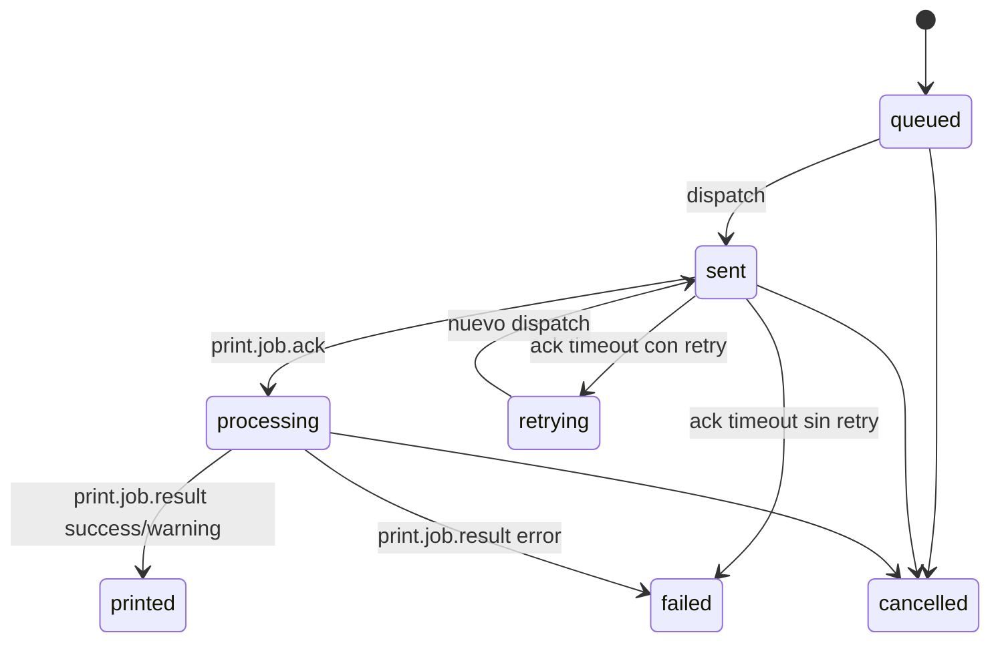

# 02 - Flujo End-to-End

## Resumen del flujo

1. Cliente de negocio crea un print job por HTTP.
2. Servicio persiste el job con estado inicial.
3. Operacion de dispatch envia evento WS al room de la impresora.
4. Cliente impresor responde ACK.
5. Cliente impresor reporta resultado final.
6. Servicio actualiza estado final y persiste log.
7. Endpoint monitor expone estado agregado y anomalias.

## Flujo detallado

### Paso 1: Creacion de trabajo

- Endpoint: POST /api/print-jobs
- Validaciones clave:
  - tenantId requerido
  - documentType requerido
  - format requerido (enum)
  - payload requerido (JSON)
- Idempotencia en create:
  - por requestId
  - por externalId
  - por contentHash en estados activos

Salida:

- Se crea registro en print_jobs
- Se emite print.job.created

### Paso 2: Dispatch

- Endpoint: POST /api/print-jobs/:id/dispatch
- Reglas:
  - si no existe: 404
  - si estado ya es sent/processing/printed: no redispara
  - si no tiene printerId: 400

Acciones:

- estado -> sent
- sentAt -> now
- attempts += 1
- crea log sent_to_printer
- emite print.job.dispatch al room device:{printerId}
- emite print.job.updated
- programa timeout de ACK

### Paso 3: ACK del cliente impresor

- Evento de entrada: print.job.ack
- Reglas:
  - job debe existir
  - tenant debe coincidir
  - estado actual debe ser sent

Acciones:

- estado -> processing
- processingAt -> now
- log event -> validated
- emite print.job.updated y print.job.log.created

### Paso 4: Resultado del cliente impresor

- Evento de entrada: print.job.result
- Reglas:
  - job debe existir
  - tenant debe coincidir
  - evita duplicados
  - no permite transicion invalida
  - estados permitidos para result: sent, processing, retrying

Acciones:

- success|warning -> estado printed
- error -> estado failed
- processedAt -> now
- en error guarda lastErrorCode/errorMessage
- crea log printed o failed
- emite print.job.updated y print.job.log.created

### Paso 5: Timeout de ACK

Si no llega ACK a tiempo:

- para estado sent:
  - si aun puede reintentar -> estado retrying
  - si no -> estado failed + processedAt + error ACK_TIMEOUT
- crea log de timeout
- emite print.job.updated y print.job.log.created

## Estados de trabajo

Estados principales:

- queued
- routing
- processing
- sent
- printed
- failed
- cancelled
- retrying

## Diagrama simplificado

